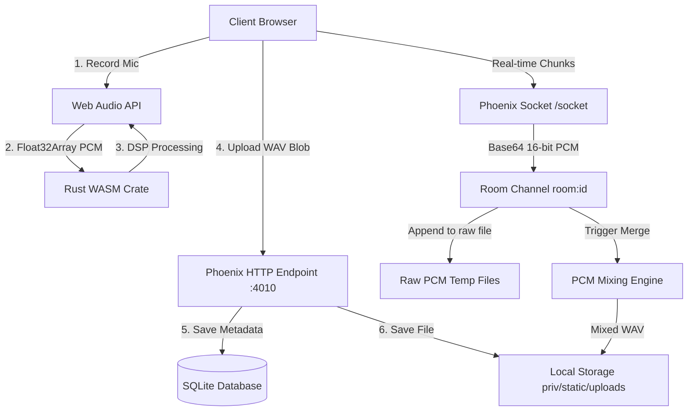

# Timbre Audio Studio — System Architecture Documentation

Timbre is a full-stack, low-latency, collaborative audio recording and digital signal processing (DSP) application. It bridges browser-based audio capturing with high-performance Rust WebAssembly (WASM) execution and real-time multiplayer coordination using Elixir/Phoenix WebSockets (Channels).

This document serves as the entry point and index for the production-grade documentation of the system.

---

## 🗺️ System Overview & Sub-Pages

To understand the system in detail, navigate through the following sub-pages:

* **[Frontend Architecture (React 19)](file:///home/dell/iv-fullstack-eng-assignment-ArnavPundir22-main/docs/frontend.md)**: Details the Web Audio API media pipeline, chunk processing, and TypeScript WAV encoding.
* **[Rust WASM DSP Crate (`timbre_kit`)](file:///home/dell/iv-fullstack-eng-assignment-ArnavPundir22-main/docs/wasm_dsp.md)**: Explains the math and implementation behind the Rust-based Gain, Normalize, and Low-pass filter algorithms.
* **[Backend Architecture & Database (Phoenix API)](file:///home/dell/iv-fullstack-eng-assignment-ArnavPundir22-main/docs/backend.md)**: Explains the Ecto SQLite persistence layer and media upload/download controllers.
* **[Multiplayer Channels & Mixing Engine](file:///home/dell/iv-fullstack-eng-assignment-ArnavPundir22-main/docs/multiplayer.md)**: Explains the real-time WebSocket protocol for streaming audio chunks and the server-side summing and clamping algorithm.

---

## 🏗️ System Architecture

The following diagram illustrates how data flows through the application during recording, local processing, and multiplayer sessions:



---

## 📂 Repository Layout

```
timbre/
├── api/                       # Phoenix 1.8 JSON API (Elixir)
│   ├── lib/timbre/            # Core DB schemas and Ecto Contexts
│   ├── lib/timbre_web/        # Controllers, Channels, and Sockets
│   └── priv/repo/             # Migrations and SQLite database configuration
├── web/                       # React 19 Frontend Web Application
│   ├── src/                   # React components and TS helpers
│   └── crates/timbre_kit/     # Rust crate compiled to WASM
├── docs/                      # Production-grade system documentation
└── justfile                   # Task runner commands (setup, dev, test)
```

---

## 🚀 How to Run Locally

### Prerequisites
Make sure you have the following installed:
* **Node.js**: v22+
* **Elixir**: v1.17+
* **Erlang**: v25+ (with `erlang-dev` headers)
* **Rust**: stable toolchain with `wasm32-unknown-unknown` target
* **wasm-pack**: v0.12+ (installed via `npm install -g wasm-pack`)
* **just**: command runner

### Setup
Run the setup command to compile the Rust WASM crate, install all dependencies, and initialize the SQLite database:
```bash
just setup
```

### Run
Launch both the Phoenix backend API and Vite dev servers concurrently:
```bash
just dev
```
Open [http://localhost:5173](http://localhost:5173) in your browser.
